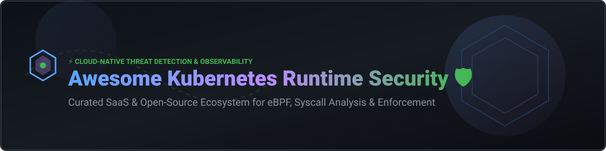

  

  
  
  
  
  

# 🛡️ Awesome Kubernetes Runtime Security: Top SaaS & Open-Source Tools Ecosystem 🚀

A curated, SEO-optimized list of **SaaS Products & Open-Source GitHub Projects** for **Kubernetes Runtime Security**, **Container Runtime Threat Detection**, **eBPF Observability**, **Admission Control**, and **Cloud-Native Workload Hardening**.

> 💡 **Market Overview:** The Kubernetes and Container Security market size is estimated at **$2.5 Billion** and is projected to reach **$8.2 Billion by 2030**. The sector is **moderately fragmented**, featuring high-valuation Cloud Native Application Protection Platforms (CNAPPs) alongside agile, eBPF-native specialized security vendors and deeply adopted CNCF open-source projects. 📈

---

## 📑 Table of Contents
- [☁️ SaaS & Hosted Security Platforms](#%EF%B8%8F-saas--hosted-security-platforms)
- [🔓 Open-Source GitHub Projects](#-open-source-github-projects)
- [🏗️ Architecture & Reference Security Stack](#%EF%B8%8F-architecture--reference-security-stack)
- [🤝 How to Contribute](#-how-to-contribute)
- [💖 Support & Sponsorship](#-support--sponsorship)
- [📈 Star History](#-star-history)
- [⚠️ Disclaimer](#%EF%B8%8F-disclaimer)

---

## ☁️ SaaS & Hosted Security Platforms

Below is a comparison of top commercial Kubernetes runtime security platforms sorted by company valuation / revenue (descending). 📊

| 🏢 Platform / Vendor | 💰 Valuation / Revenue | 💵 Base / Starting Pricing | 🎁 Free Tier / Trial Limit | 🛡️ Key Runtime Security Features |
| :--- | :--- | :--- | :--- | :--- |
| **CrowdStrike Falcon Cloud Security** | **$8.0B Valuation** (~$1.0B+ ARR) | ~$215 / workload / year | 15-day free trial (Full platform access) | Single eBPF-first agent, EDR lineage, MITRE ATT&CK correlation, runtime threat intel. |
| **Palo Alto Networks (Prisma Cloud)** | **$8.0B+ Business Segment** (PANW $100B+ Cap) | ~$18,000 / year (Base CNAPP credit pool) | 30-day free trial (Full platform evaluation) | Defender agent with default eBPF mode, immutable container policy, runtime drift prevention. |
| **Wiz Runtime Sensor** | **$12.0B Valuation** (~$500M ARR) | ~$24,000 / year (Wiz Essential baseline 100 workloads) | Free PoC / 14-day evaluation trial | eBPF runtime sensor integrated with agentless cloud graph for risk prioritization. |
| **SentinelOne Singularity Cloud** | **$7.8B Valuation** (~$1.0B ARR) | ~$144 / workload / year (Singularity Complete) | 30-day free trial | eBPF-based runtime sensor, automated AI-powered threat response, container XDR. |
| **Aqua Security** | **$1.0B Valuation** (~$100M ARR) | ~$35 / workload / month (Annual plan) | 14-day free trial (No credit card required) | Aqua Enforcer sensor (eBPF/kernel module), runtime drift prevention, MalwareScan engine. |
| **Sysdig Secure** | **$2.5B Valuation** (~$100M ARR) | ~$240 / host / year | 30-day evaluation trial | Built by Falco creators; syscall-level eBPF forensics, managed Falco rules, FedRAMP authorized. |
| **Tigera Calico Cloud** | **$300M Est. Valuation** (~$35M ARR) | ~$30 / node / month | Free Tier available (Single-cluster flow graph & log analysis) | L7 network policy enforcement on eBPF dataplane, runtime threat detection, compliance. |
| **NeuVector (SUSE Security)** | **Acquired by SUSE** (SUSE ~$2.5B Valuation) | ~$78 / node / month (AWS Marketplace) | 30-day free trial | Container security platform with automated network/process behavioral learning. |
| **StackRox (Red Hat ACS)** | **Acquired by Red Hat / IBM** | Enterprise contract pricing (~$250/node/yr) | Free Open-Source version (RHACS trial via Red Hat) | Kubernetes-native runtime threat detection, admission policy correlation, OpenShift integration. |
| **ARMO Platform** | **~$50M Valuation** (Series A funded) | ~$30 / worker node / month | 14-day free trial (ArmoSense tier) | Commercial runtime detection engine built around CNCF Kubescape. |

---

## 🔓 Open-Source GitHub Projects

Curated list of top open-source Kubernetes runtime security, eBPF threat detection, and policy enforcement tools sorted by **GitHub Stars_Count (descending)**. ⭐

| 📦 Project Name | ⭐ Stars | 📜 License | 🔍 Description & Use Case |
| :--- | :--- | :--- | :--- |
| **[Aqua Trivy](https://github.com/aquasecurity/trivy)** |  | Apache-2.0 | Comprehensive vulnerability scanner for container images, file systems, Git repos, and Kubernetes clusters. |
| **[Falco](https://github.com/falcosecurity/falco)** |  | Apache-2.0 | CNCF Graduated runtime security engine monitoring syscalls and kernel events for anomalous workload behavior. |
| **[Kyverno](https://github.com/kyverno/kyverno)** |  | Apache-2.0 | Kubernetes-native policy engine for admission control, mutation, generation, and runtime validation. |
| **[Kubescape](https://github.com/kubescape/kubescape)** |  | Apache-2.0 | CNCF Incubating Kubernetes posture management, NSA hardening compliance, and runtime threat detection. |
| **[Pixie](https://github.com/pixie-io/pixie)** |  | Apache-2.0 | CNCF Sandbox eBPF-based observability platform providing instant code-level visibility and security tracing. |
| **[Cilium Tetragon](https://github.com/cilium/tetragon)** |  | Apache-2.0 | eBPF-based security observability and real-time process-level runtime enforcement via `bpf_send_signal()`. |
| **[Aqua Tracee](https://github.com/aquasecurity/tracee)** |  | Apache-2.0 | Linux runtime security and forensic engine using eBPF for behavioral threat detection and malware identification. |
| **[OPA Gatekeeper](https://github.com/open-policy-agent/gatekeeper)** |  | Apache-2.0 | Policy Controller for Kubernetes integrating Open Policy Agent (OPA) for validating and enforcing CRD policies. |
| **[Inspektor Gadget](https://github.com/inspektor-gadget/inspektor-gadget)** |  | Apache-2.0 | Collection of eBPF-based tools and gadgets for inspecting, debugging, and observing Kubernetes applications. |
| **[KubeArmor](https://github.com/kubearmor/KubeArmor)** |  | Apache-2.0 | Runtime security enforcement system using LSMs (AppArmor, SELinux, BPF-LSM) for inline process/file blocking. |
| **[NeuVector Core](https://github.com/neuvector/neuvector)** |  | Apache-2.0 | Open-source container security platform delivering end-to-end security with automated network inspection. |
| **[KubeCop](https://github.com/armosec/kubecop)** |  | Apache-2.0 | Runtime detection and automated response agent for suspicious events in Kubernetes workloads. |

---

## 🏗️ Architecture & Reference Security Stack

The modern **2026 Reference Cloud-Native Security Stack** recommended for production Kubernetes clusters combines multiple layers of defense: ⚡

1. 🔍 **Pre-deployment & CI/CD Scanning:** [Aqua Trivy](https://github.com/aquasecurity/trivy) for vulnerability and SBOM scanning.
2. 🚪 **Admission Control & Policy Enforcement:** [Kyverno](https://github.com/kyverno/kyverno) or [OPA Gatekeeper](https://github.com/open-policy-agent/gatekeeper) for workload admission gating.
3. 👁️ **Runtime Threat Detection:** [Falco](https://github.com/falcosecurity/falco) or [Aqua Tracee](https://github.com/aquasecurity/tracee) for kernel syscall monitoring.
4. 🛑 **Inline Prevention & Hardening:** [Cilium Tetragon](https://github.com/cilium/tetragon) or [KubeArmor](https://github.com/kubearmor/KubeArmor) using Linux Security Modules (BPF-LSM).
5. 📊 **Observability & Alerting:** Prometheus, Grafana, and Falcosidekick for alert routing.

---

## 🤝 How to Contribute

Contributions are always welcome! 🎉
1. 🍴 Fork the repository.
2. 📝 Update `README.md` keeping the Markdown tabular formatting consistent.
3. 🔎 Ensure exact pricing, trial terms, Stars_Badge formatting, and facts are included.
4. 🔀 Open a Pull Request with a clear summary of changes.

---

## 💖 Support & Sponsorship

Thank you for visiting and using this curated list! If you found this repository helpful, please consider giving it a ⭐ **Star**, **Forking** it, and sharing it with your network! 🚀

If you would like to support the ongoing maintenance and creation of awesome lists like this, you can buy me a coffee via the GitHub Sponsor Dashboard:

---

## 📈 Star History

---

## ⚠️ Disclaimer

This project is a community-curated list intended for informational and research purposes only. Kubernetes runtime security tools require kernel compatibility checks (eBPF vs kernel modules) and careful performance benchmarking before production deployment. 🛠️

Made with ❤️ for DevSecOps engineers, Platform teams, Cloud Architects, and Security Engineers.
